# 🕸️ KobeanAudio Repository Architecture & Dependency Codegraph

This document serves as the **Code Intelligence & Architecture Graph** for developers, engineers, and AI agents building and extending the KobeanAudio monorepo.

---

## 🏛️ System Architecture Topology

```mermaid
graph TD
  subgraph Frontend ["🖥️ Apps/Web & Desktop Shell (Next.js 15 + Tauri 2.x)"]
    TopNav["TopNav.tsx<br/><i>3-Zone Apple HIG Title Bar</i>"]
    Editor["TextEditor.tsx<br/><i>Studio Blocks, Script & Templates</i>"]
    Inspector["StudioInspector.tsx<br/><i>Acoustic Sliders, Voice Picker, Takes</i>"]
    Player["AudioPlayer.tsx<br/><i>WaveSurfer.js Waveform Transport</i>"]
    Explorer["AudioFilesSidebar.tsx<br/><i>IDE Audio Asset Explorer</i>"]
    TagsPage["TagsManagerPage.tsx<br/><i>120+ Tag Taxonomy Library</i>"]
    TrimModal["AudioTrimDialog.tsx<br/><i>WaveSurfer Audition & DSP Slicing</i>"]
    ExportModal["ExportDialog.tsx<br/><i>DSP LUFS & Folder Picker Modal</i>"]
    CloneModal["VoiceCloneDialog.tsx<br/><i>Zero-Shot Voice Cloning</i>"]
    MotionEngine["motion.ts<br/><i>Unified Apple Spring Motion Engine</i>"]
  end

  subgraph StateStores ["📦 Zustand Reactive Stores"]
    EngineStore["useEngineStore<br/><i>Active Engine & Acoustic State</i>"]
    ProjectStore["useProjectStore<br/><i>Script & Active Project SQLite</i>"]
    PlayerStore["usePlayerStore<br/><i>Playback, Audio URL, Zoom</i>"]
    TagStore["useTagStore<br/><i>Tag Taxonomy & Custom Tags</i>"]
    AudioStore["useAudioFilesStore<br/><i>Disk Audio File Scanner</i>"]
    ThemeStore["useThemeStore<br/><i>9 Studio Color Themes</i>"]
  end

  subgraph API ["🔌 FastAPI Backend (Python 3.12+)"]
    RouteGen["POST /api/v1/generate<br/><i>SSE Streaming & Engine Routing</i>"]
    RouteExp["POST /api/v1/export<br/><i>DSP Export & Finder Reveal</i>"]
    RouteTrim["POST /api/v1/export/trim<br/><i>Audio Slice & Fade DSP</i>"]
    RouteProj["CRUD /api/v1/projects<br/><i>Workspace Database Manager</i>"]
    RouteEng["GET /api/v1/engines<br/><i>Capabilities & Quota Telemetry</i>"]
    RouteClone["POST /api/v1/clone-voice<br/><i>Reference Audio Processing</i>"]
  end

  subgraph TTSEngines ["⚡ Multi-Engine TTS Layer"]
    Kokoro["Kokoro-82M ONNX<br/><i>Apple Silicon M3 Metal (14x Fast)</i>"]
    Orpheus["Orpheus LLM<br/><i>Expressive Dialogue with Tags</i>"]
    Chatterbox["Chatterbox MLX<br/><i>Zero-Shot Voice Timbre Cloning</i>"]
    Gemini["Google Gemini Pro<br/><i>Cloud Speech & Director Notes</i>"]
    Piper["Piper TTS<br/><i>Ultra-Fast CPU/GPU Speech</i>"]
    Qwen3["Qwen3 Audio<br/><i>Multilingual Speech Synthesis</i>"]
    NeuralFallback["Neural Synth Fallback<br/><i>Tag Stripping & Cascade</i>"]
  end

  subgraph DSP ["🎛️ Digital Signal Processing (DSP)"]
    AudioProc["AudioProcessor<br/><i>DSP Orchestrator</i>"]
    RIFF["RIFF Header Packer<br/><i>44-byte Canonical WAV Header</i>"]
    LUFS["LUFS Loudness Normalizer<br/><i>-16 LUFS / -23 LUFS Standard</i>"]
    Trim["Silence & Slicing Trimmer<br/><i>Leading/Trailing Noise Removal & Cut</i>"]
    Codecs["FFmpeg Audio Codecs<br/><i>MP3 (320k), FLAC, OGG, M4A</i>"]
  end

  subgraph Types ["📐 Shared TypeScript Types"]
    SchemaTTS["TTSRequest & TTSRequestPayload"]
    SchemaGen["GenerationRecord & Telemetry"]
    SchemaFile["AudioFileItem & ExportOptions"]
    SchemaTrim["TrimAudioOptions & TrimAudioResult"]
  end

  %% Dataflow & Dependencies
  Editor -->|Update textContent| ProjectStore
  Editor -->|Drag & Drop Tags| TagStore
  Inspector -->|Select Voice & Sliders| EngineStore
  Player -->|Waveform Playback| PlayerStore
  Player -->|Open Trim Modal| TrimModal
  Explorer -->|List & Reveal Files| AudioStore
  TopNav -->|Theme Token Sync| ThemeStore
  MotionEngine -.->|Unified Springs| Frontend

  ProjectStore -->|Fetch Projects| RouteProj
  EngineStore -->|Fetch Engines & Quota| RouteEng
  AudioStore -->|Scan & Delete Files| RouteExp
  TrimModal -->|Post DSP Trim| RouteTrim

  RouteGen --> Kokoro
  RouteGen --> Orpheus
  RouteGen --> Chatterbox
  RouteGen --> Gemini
  RouteGen --> Piper
  RouteGen --> Qwen3
  RouteGen --> NeuralFallback

  Kokoro --> AudioProc
  Orpheus --> AudioProc
  Chatterbox --> AudioProc
  Gemini --> AudioProc
  Piper --> AudioProc
  Qwen3 --> AudioProc
  NeuralFallback --> AudioProc

  AudioProc --> RIFF
  AudioProc --> LUFS
  AudioProc --> Trim
  RouteExp --> Codecs
  RouteTrim --> AudioProc

  SchemaTTS -.-> RouteGen
  SchemaGen -.-> ProjectStore
  SchemaFile -.-> AudioStore
  SchemaTrim -.-> RouteTrim
```

---

## 📊 Module & Component Dependency Matrix

| Layer | Module / File | Primary Exports | Upstream Dependencies | Downstream Consumers |
| :--- | :--- | :--- | :--- | :--- |
| **Engine** | `kokoro_engine.py` | `KokoroEngine` | `onnxruntime`, `soundfile` | `generate.py`, `AudioProcessor` |
| **Engine** | `orpheus_engine.py` | `OrpheusEngine` | `torch`, `mlx` | `generate.py`, `AudioProcessor` |
| **Engine** | `chatterbox_engine.py` | `ChatterboxEngine` | `mlx_audio`, `soundfile` | `generate.py`, `clone.py` |
| **Engine** | `gemini_engine.py` | `GeminiEngine` | `google-genai` | `generate.py`, `AudioProcessor` |
| **DSP** | `audio_processor.py` | `AudioProcessor` | `numpy`, `soundfile`, `pydub` | `generate.py`, `export.py` |
| **DSP** | `riff_packer.py` | `pack_riff_wav_header` | `struct`, Python stdlib | `audio_processor.py` |
| **API** | `generate.py` | `POST /generate` | TTS Engines, `AudioProcessor` | `apps/web/lib/api.ts` |
| **API** | `export.py` | `POST /export`, `/trim`, `/files` | `AudioProcessor`, `osascript` | `apps/web/lib/api.ts` |
| **Motion** | `motion.ts` | `SPRINGS`, `dropdownMotion`, `modalMotion` | `framer-motion` | All UI Components & Modals |
| **Store** | `engineStore.ts` | `useEngineStore` | `api.ts` | `StudioInspector`, `TopNav` |
| **Store** | `projectStore.ts` | `useProjectStore` | `api.ts` | `TextEditor`, `StudioInspector` |
| **Store** | `audioFilesStore.ts`| `useAudioFilesStore`| `api.ts` | `AudioFilesSidebar`, `TopNav` |
| **Store** | `tagStore.ts` | `useTagStore` | LocalStorage, defaults | `TagsManagerPage`, `TextEditor` |
| **Store** | `themeStore.ts` | `useThemeStore` | DOM `data-theme` | `TopNav`, `globals.css` |
| **UI** | `TopNav.tsx` | `TopNav` | `useProjectStore`, `useEngineStore`, `useAudioFilesStore` | `StudioPage` (Native macOS insets, project selector, Live-Sync Refresh, engine switcher) |
| **UI** | `TextEditor.tsx` | `TextEditor` | `useProjectStore`, `useTagStore`| `StudioPage` |
| **UI** | `AudioPlayer.tsx` | `AudioPlayer` | `wavesurfer.js`, `usePlayerStore`| `StudioPage` |
| **UI** | `AudioTrimDialog.tsx` | `AudioTrimDialog` | `wavesurfer.js`, `export.py` | `StudioPage`, `AudioPlayer` (Direct DAW Waveform Trimming, In/Out drag handles, auto-snap silence) |
| **UI** | `ExportDialog.tsx` | `ExportDialog` | `api.ts`, `useAudioFilesStore` | `StudioPage`, `AudioPlayer` |
| **UI** | `TagsManagerPage.tsx`| `TagsManagerPage` | `useTagStore`, `motion.ts`, `api.ts` | `StudioPage` |
| **UI** | `TagInsertionDialog.tsx`| `TagInsertionDialog` | `useProjectStore`, `motion.ts` | `TagsManagerPage`, `TextEditor` |
| **UI** | `PlaygroundApplyDialog.tsx`| `PlaygroundApplyDialog`| `useProjectStore`, `motion.ts` | `TagsManagerPage` |
| **UI** | `AudioFilesSidebar.tsx`| `AudioFilesSidebar` | `useAudioFilesStore` | `StudioPage` |

---

## ⚡ Key Architectural Rules for KobeanAudio Developers

1. **Audio Header Integrity**: Never return raw audio chunks without verifying standard RIFF headers (PCM 16-bit 24kHz / 22.05kHz / 48kHz).
2. **Strict Dynamic Theming & Solid Glass Elevation**: Never use hardcoded color values (`bg-cyan-500`, `bg-[#10101C]`). Always use CSS tokens (`var(--accent-primary)`, `var(--bg-surface-elevated)`). Popovers and elevated dropdowns must use `.glass-popover` to prevent underlying elements from bleeding through.
3. **Unified Motion & Spring Physics**: All dropdowns, dialogs, drawers, and buttons must consume centralized motion tokens from `apps/web/src/lib/motion.ts` (`dropdownMotion`, `modalMotion`, `buttonTapMotion`).
4. **Zero-Any TypeScript**: All frontend API payloads and state interfaces must use strict Pydantic-mirrored types from `@kobeanaudio/types`.
5. **Resilient Native Integration**: Native OS calls (such as folder pickers, Finder reveals) must handle user cancellation gracefully without throwing unhandled exceptions.
