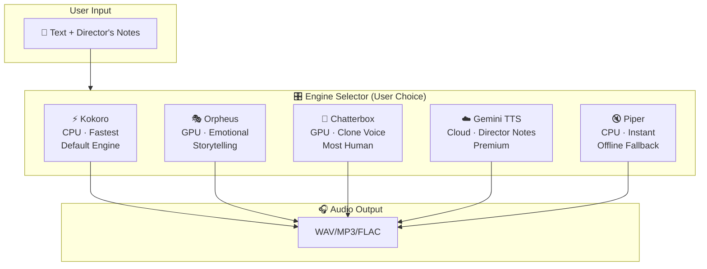

# 🔬 TTS Audio Core Models — Deep Research Report

> **Goal**: Find the most human-sounding, high-quality TTS models for KobeanAudio, prioritizing free/open-source options.

---

## 📊 Executive Summary — The Verdict

The good news: **open-source TTS in 2026 rivals or beats commercial services** in blind listening tests. You don't need to rely solely on Gemini TTS. Here's the strategy I recommend:

```
┌─────────────────────────────────────────────────────────────┐
│              KobeanAudio Multi-Engine Architecture           │
│                                                             │
│  🥇 PRIMARY   → Kokoro (82M)     — Fast, free, CPU-only    │
│  🥈 PREMIUM   → Chatterbox       — Voice cloning, MIT      │
│  🥉 EXPRESSIVE→ Orpheus (3B)     — Emotion tags, human     │
│  🔄 CLOUD     → Gemini TTS       — Your existing code      │
│  📦 FALLBACK  → Piper            — Offline, edge, instant  │
└─────────────────────────────────────────────────────────────┘
```

> [!TIP]
> **Bottom line**: Use **Kokoro** as your default engine (runs on CPU, Apache 2.0, sounds amazing), **Chatterbox** for voice cloning features, **Orpheus** when you need emotional/expressive speech, and keep **Gemini TTS** as a premium cloud option. All free.

---

## 🏆 Model Rankings (by Human-Likeness)

| Rank | Model | Human-Likeness | Free? | GPU Required? | License | Best For |
|:----:|-------|:--------------:|:-----:|:-------------:|---------|----------|
| 🥇 | **Chatterbox** | ⭐⭐⭐⭐⭐ | ✅ | ✅ (6GB+) | MIT | Voice cloning, beats ElevenLabs |
| 🥇 | **Orpheus TTS** | ⭐⭐⭐⭐⭐ | ✅ | ✅ (8GB+) | Apache 2.0 | Emotional, expressive narration |
| 🥈 | **Kokoro** | ⭐⭐⭐⭐½ | ✅ | ❌ CPU OK! | Apache 2.0 | Speed + quality, runs anywhere |
| 🥈 | **Fish Speech S2** | ⭐⭐⭐⭐½ | ✅ | ✅ (8GB+) | Apache 2.0 | Multilingual, commercial quality |
| 🥈 | **Qwen3-TTS** | ⭐⭐⭐⭐½ | ✅ | ✅ (6GB+) | Apache 2.0 | All-in-one, 10 languages |
| 🥉 | **F5-TTS** | ⭐⭐⭐⭐½ | ⚠️ | ✅ (8GB+) | CC-BY-NC | Voice cloning (non-commercial) |
| 🥉 | **Dia (Nari Labs)** | ⭐⭐⭐⭐ | ✅ | ✅ (8GB+) | Apache 2.0 | Multi-speaker dialogue |
| 🥉 | **Sesame CSM** | ⭐⭐⭐⭐ | ✅ | ✅ (8GB+) | Apache 2.0 | Conversational, turn-taking |
|  4  | **Gemini TTS** | ⭐⭐⭐⭐⭐ | ⚠️ Free tier* | ❌ Cloud | Proprietary | Director's notes, cloud API |
|  5  | **Piper** | ⭐⭐⭐½ | ✅ | ❌ CPU OK! | MIT | Ultra-fast, embedded, offline |
|  6  | **Parler TTS** | ⭐⭐⭐½ | ✅ | ✅ (4GB+) | Apache 2.0 | Prompt-based voice control |

> ⚠️ Gemini TTS free tier: ~10-30 RPM for testing, but TTS models may require billing for production use.

---

## 🔍 Detailed Model Profiles

---

### 🥇 1. Kokoro — "The Lightweight Champion"

| Attribute | Details |
|-----------|---------|
| **Developer** | Hexgrad (community) |
| **Parameters** | 82M (tiny!) |
| **Architecture** | StyleTTS 2 |
| **License** | Apache 2.0 ✅ |
| **GPU Required** | ❌ Runs on CPU, even Raspberry Pi |
| **Model Size** | ~330MB |
| **Languages** | English (primary), Japanese, Chinese, Korean, French |
| **Sample Rate** | 24kHz |
| **Streaming** | ✅ Yes (via `streaming-tts` or FastAPI wrapper) |
| **Voice Cloning** | ❌ No (uses pre-built voice packs) |
| **Real-Time Factor** | ~0.1x (10x faster than real-time on CPU) |

**Why it's special**: Kokoro punches astronomically above its weight. 82M parameters producing audio that rivals models 50x its size. It runs on a laptop CPU without breaking a sweat.

**Available Voices**: `af_heart`, `af_sarah`, `am_adam`, `bf_emma`, `bm_george`, and 50+ more community voices.

**Integration Example**:
```python
# Option A: Direct Python (simplest)
from streaming_tts import TextToAudioStream, KokoroEngine

engine = KokoroEngine(voice="af_heart")
stream = TextToAudioStream(engine)
stream.feed("Hello world! This sounds incredibly human.").play()

# Option B: OpenAI-compatible API (production)
# docker run -p 8880:8880 remsky/kokoro-fastapi:latest
from openai import OpenAI
client = OpenAI(base_url="http://localhost:8880/v1", api_key="not-needed")

with client.audio.speech.with_streaming_response.create(
    model="kokoro",
    voice="af_heart",
    input="Streaming audio with Kokoro locally."
) as response:
    response.stream_to_file("output.mp3")
```

**🟢 Verdict**: Best default engine for KobeanAudio. Free, fast, great quality, no GPU needed.

---

### 🥇 2. Chatterbox — "The ElevenLabs Killer"

| Attribute | Details |
|-----------|---------|
| **Developer** | Resemble AI |
| **Parameters** | ~300M |
| **Architecture** | Custom encoder-decoder |
| **License** | MIT ✅ |
| **GPU Required** | ✅ NVIDIA GPU recommended (6GB+ VRAM) |
| **Languages** | 23+ languages (Multilingual V3) |
| **Voice Cloning** | ✅ Zero-shot from 5-15 seconds of audio |
| **Emotion Control** | ✅ Adjustable exaggeration slider |
| **Streaming** | ✅ Chatterbox-Turbo variant |
| **Safety** | Built-in PerTh watermarking |

**Why it's special**: Frequently **beats ElevenLabs in blind A/B tests**. The voice cloning from just 5 seconds of reference audio is stunningly accurate. MIT license means full commercial freedom.

**Integration Example**:
```python
# pip install chatterbox-tts
from chatterbox.tts import ChatterboxTTS

model = ChatterboxTTS.from_pretrained("cuda")

# Basic generation
wav = model.generate("Hello! This is my cloned voice speaking.")

# With voice cloning (provide a 5-15s reference clip)
wav = model.generate(
    "Now I sound exactly like the reference speaker!",
    audio_prompt_path="reference_voice.wav"
)

# With emotion exaggeration (0.0 = monotone, 1.0 = highly expressive)
wav = model.generate(
    "I am SO excited about this!",
    exaggeration=0.7
)
```

**🟢 Verdict**: Best choice when users want to clone their own voice or need maximum naturalness with GPU.

---

### 🥇 3. Orpheus TTS — "The Emotional Storyteller"

| Attribute | Details |
|-----------|---------|
| **Developer** | Canopy Labs |
| **Parameters** | 3B |
| **Architecture** | Llama-3 backbone (Speech-LLM) |
| **License** | Apache 2.0 ✅ |
| **GPU Required** | ✅ ~8GB VRAM (Q4 quantized), ~6GB (Q4_K_M GGUF) |
| **Languages** | English |
| **Voice Cloning** | ❌ Uses pre-built voices |
| **Emotion Tags** | ✅ `<laugh>`, `<sigh>`, `<gasp>`, `<yawn>`, `<cough>` |
| **Streaming** | ✅ Real-time streaming inference |
| **Voices** | `tara`, `leah`, `jess`, `leo`, `dan`, `mia`, `zac`, `zoe` |

**Why it's special**: Built on Llama-3, so it truly **understands** text context and generates emotionally appropriate prosody. The inline emotion tags (`<laugh>`, `<sigh>`) create incredibly human-like speech with natural reactions.

**Integration Example**:
```python
# Option A: Direct library
from orpheus_tts import OrpheusModel

model = OrpheusModel(model_name="canopylabs/orpheus-tts-0.1-finetune-prod")
text = "I can't believe it! <laugh> This is amazing! <sigh> But also bittersweet."
audio = model.generate(text, voice="tara")

# Option B: OpenAI-compatible local server (via LM Studio / llama.cpp)
import requests
response = requests.post("http://127.0.0.1:1234/v1/audio/speech", json={
    "model": "orpheus",
    "input": "Natural speech with real emotions <laugh>",
    "voice": "tara"
})
with open("speech.wav", "wb") as f:
    f.write(response.content)
```

**🟢 Verdict**: Best for audiobooks, storytelling, and any content needing emotional depth. The emotion tags align perfectly with KobeanAudio's director's note concept.

---

### 🥈 4. Fish Speech S2 Pro — "The Multilingual Powerhouse"

| Attribute | Details |
|-----------|---------|
| **Developer** | Fish Audio |
| **Architecture** | Dual-AR Transformer |
| **License** | Apache 2.0 ✅ |
| **GPU Required** | ✅ 8GB+ VRAM |
| **Languages** | English, Chinese, Japanese, Korean, + more |
| **Voice Cloning** | ✅ Zero-shot, high fidelity |
| **Streaming** | ✅ Low TTFA (Time-to-First-Audio) |

**Why it's special**: Separates semantic and acoustic modeling for extremely natural, multilingual output. Currently one of the top performers on benchmark leaderboards.

**🟡 Verdict**: Excellent if KobeanAudio needs strong multilingual support.

---

### 🥈 5. Qwen3-TTS — "The All-in-One Toolkit"

| Attribute | Details |
|-----------|---------|
| **Developer** | Alibaba Qwen Team |
| **Parameters** | 0.6B / 1.7B |
| **Architecture** | Non-DiT with 12Hz tokenizer |
| **License** | Apache 2.0 ✅ |
| **GPU Required** | ✅ 6GB+ VRAM |
| **Languages** | 10 languages (CN, EN, JA, KO, DE, FR, RU, PT, ES, IT) |
| **Voice Cloning** | ✅ From 3 seconds of audio |
| **Voice Design** | ✅ Natural language descriptions ("warm, low-pitched female") |
| **Emotion Control** | ✅ Via natural language instructions |
| **Streaming** | ✅ Ultra-low latency (97ms TTFA) |

**Why it's special**: You can control the voice using plain English instructions like "speak warmly and slowly" — similar to KobeanAudio's director's notes concept. Voice cloning from just 3 seconds.

**🟡 Verdict**: Most versatile option. Natural language voice control is a killer feature for KobeanAudio.

---

### 🥉 6. Dia (Nari Labs) — "The Dialogue Specialist"

| Attribute | Details |
|-----------|---------|
| **Developer** | Nari Labs |
| **Parameters** | 1.6B |
| **Architecture** | Diffusion-decoder with multi-speaker encoder |
| **License** | Apache 2.0 ✅ |
| **GPU Required** | ✅ 8GB+ VRAM (RTX 4090 recommended) |
| **Multi-Speaker** | ✅ `[S1]`, `[S2]` tags for different characters |
| **Non-Verbal** | ✅ Laughter, coughing, gasps, throat-clearing |
| **Voice Cloning** | ✅ Audio prompt conditioning |

**Why it's special**: Purpose-built for dialogue — generates multi-character conversations from a single script. Perfect for podcast-style content or audiobook dialogues.

**🟡 Verdict**: Great for podcast/dialogue generation features in KobeanAudio.

---

### 🥉 7. Sesame CSM — "The Conversational Expert"

| Attribute | Details |
|-----------|---------|
| **Developer** | Sesame AI Labs |
| **Parameters** | 1B |
| **Architecture** | Llama backbone + Mimi audio decoder |
| **License** | Apache 2.0 ✅ |
| **GPU Required** | ✅ CUDA required |
| **Specialty** | Natural turn-taking, backchannels, consistent tone |

**Why it's special**: Understands conversational context — maintains tone across turns, handles natural interruptions and back-channeling ("mm-hmm", "right").

**🟡 Verdict**: Research-oriented. Good for future conversational AI features.

---

### 🥉 8. F5-TTS — "The Clone Master"

| Attribute | Details |
|-----------|---------|
| **Developer** | SWivid / Shanghai AI Lab |
| **Architecture** | Non-autoregressive flow-matching + DiT |
| **License** | ⚠️ CC-BY-NC-4.0 (Non-commercial only!) |
| **GPU Required** | ✅ 8GB+ VRAM |
| **Voice Cloning** | ✅ Best-in-class zero-shot cloning |
| **RTF** | ~0.15 (very fast) |

> [!WARNING]
> **License restriction**: CC-BY-NC means **no commercial use** without special arrangement. This limits its viability for KobeanAudio if you plan to monetize.

**🟡 Verdict**: Incredible quality but non-commercial license is a dealbreaker. Consider only for personal/research use.

---

### 📌 9. Gemini TTS — "Your Existing Engine" (Cloud)

| Attribute | Details |
|-----------|---------|
| **Model** | `gemini-3.1-flash-tts-preview` |
| **Provider** | Google |
| **License** | Proprietary (API-based) |
| **Free Tier** | ⚠️ ~10-30 RPM for testing; production requires billing |
| **GPU Required** | ❌ Cloud-based |
| **Director's Notes** | ✅ Rich markup with `[emotion]`, `[pause: Xs]` |
| **Voices** | Prebuilt: Algenib, Achernar, Alnilam, etc. |
| **Streaming** | ✅ `generate_content_stream()` |
| **Output** | PCM L16 24kHz → WAV |
| **Arena Ranking** | Top tier (Gemini 3.1 leads Speech Agent Arena) |

**Why keep it**: Highest quality for the director's note workflow you already built. No local GPU needed. The rich markup format (`[warm, celebratory]`, `[pause: 1.5s]`) is a unique strength.

**Limitations**: Not truly free at scale. Rate-limited. Cloud-dependent. Proprietary.

**🟡 Verdict**: Keep as a premium "cloud engine" option alongside free local engines.

---

### 📌 10. Piper — "The Instant Offline Engine"

| Attribute | Details |
|-----------|---------|
| **Developer** | Rhasspy |
| **License** | MIT ✅ |
| **GPU Required** | ❌ Runs on anything (even Raspberry Pi Zero) |
| **Latency** | Near-instant (< 50ms for short text) |
| **Model Size** | 15-75MB per voice |
| **Languages** | 30+ languages |
| **Quality** | Good but not as natural as top models |

**🟡 Verdict**: Perfect fallback for instant, offline, zero-latency TTS. Lower quality but unbeatable speed.

---

## 🏗️ Recommended Multi-Engine Architecture for KobeanAudio



### Engine Selection Logic

| User Scenario | Recommended Engine | Why |
|--------------|-------------------|-----|
| Quick text-to-speech, no GPU | **Kokoro** | CPU-only, fast, great quality |
| Audiobook narration with emotions | **Orpheus** | `<laugh>`, `<sigh>` emotion tags |
| "I want it to sound like ME" | **Chatterbox** | 5-second voice cloning |
| Using director's notes with `[warm]` markup | **Gemini TTS** | Native support for rich directions |
| Multilingual content (10+ languages) | **Qwen3-TTS** | Best polyglot support |
| Multi-speaker podcast/dialogue | **Dia** | `[S1]`/`[S2]` speaker tags |
| Offline / no internet | **Piper** | Works completely offline |
| Maximum naturalness, don't care about speed | **Chatterbox** or **Orpheus** | Top blind-test scores |

---

## 💰 Cost Comparison

| Engine | Cost | Infrastructure |
|--------|------|---------------|
| **Kokoro** | **\$0** | Your CPU |
| **Chatterbox** | **\$0** | Your GPU (or free Colab) |
| **Orpheus** | **\$0** | Your GPU (or free Colab) |
| **Qwen3-TTS** | **\$0** | Your GPU (or free Colab) |
| **Dia** | **\$0** | Your GPU |
| **Piper** | **\$0** | Your CPU |
| **Gemini TTS** | **\$0 (limited)** → **Paid at scale** | Google Cloud |
| **ElevenLabs** | ~\$5-\$99/mo | Their cloud |
| **Cartesia Sonic** | Paid API | Their cloud |

---

## 🔧 Integration Strategy for KobeanAudio

### Unified TTS Interface (Python Backend)

```python
# packages/audio-engine/tts_interface.py
from abc import ABC, abstractmethod
from dataclasses import dataclass
from enum import Enum
from typing import AsyncIterator

class EngineType(Enum):
    KOKORO = "kokoro"          # Default, CPU
    CHATTERBOX = "chatterbox"  # Voice cloning, GPU
    ORPHEUS = "orpheus"        # Emotional, GPU
    GEMINI = "gemini"          # Cloud, director's notes
    QWEN3 = "qwen3"           # Multilingual, GPU
    DIA = "dia"                # Multi-speaker, GPU
    PIPER = "piper"            # Offline fallback, CPU

@dataclass
class TTSRequest:
    text: str
    engine: EngineType = EngineType.KOKORO
    voice: str = "af_heart"
    temperature: float = 1.0
    emotion_exaggeration: float = 0.5  # Chatterbox
    reference_audio: bytes | None = None  # For voice cloning
    output_format: str = "wav"
    sample_rate: int = 24000

@dataclass
class AudioChunk:
    data: bytes
    chunk_index: int
    is_final: bool
    mime_type: str = "audio/wav"

class TTSEngine(ABC):
    @abstractmethod
    async def generate_stream(self, request: TTSRequest) -> AsyncIterator[AudioChunk]:
        """Stream audio chunks as they're generated."""
        ...

    @abstractmethod
    async def generate(self, request: TTSRequest) -> bytes:
        """Generate complete audio (non-streaming)."""
        ...

    @abstractmethod
    def get_available_voices(self) -> list[dict]:
        """Return list of available voices for this engine."""
        ...
```

### Engine Implementations Would Follow This Interface

Each engine (Kokoro, Chatterbox, Orpheus, Gemini, etc.) implements `TTSEngine`, and the frontend lets users **pick their engine** via the UI. The backend routes to the correct implementation.

---

## 🎯 Final Recommendation for the Enhanced Prompt

Update the KobeanAudio prompt to include **multi-engine support** with these specific models:

1. **Default Engine**: Kokoro (free, CPU, Apache 2.0)
2. **Voice Cloning Engine**: Chatterbox (free, GPU, MIT)
3. **Expressive Engine**: Orpheus (free, GPU, Apache 2.0)
4. **Cloud Premium Engine**: Gemini TTS (your existing code)
5. **Offline Fallback**: Piper (free, CPU, MIT)
6. **Optional — Multilingual**: Qwen3-TTS (free, GPU, Apache 2.0)
7. **Optional — Dialogue**: Dia (free, GPU, Apache 2.0)

> [!IMPORTANT]
> **All recommended engines are free and open-source** (except Gemini, which is kept as your existing cloud option). Users with no GPU can still get excellent quality from Kokoro on CPU alone.

---

## 📈 Arena Leaderboard Context (Aug 2026)

For reference, the current top-ranked TTS models in the [Artificial Analysis Speech Arena](https://artificialanalysis.ai/speech-arena):

| Rank | Model | Elo | Type |
|:----:|-------|:---:|------|
| 1 | Sonic 3.6 (Cartesia) | 1,283 | Paid API |
| 2 | Qwen-Audio-3.0-TTS-Plus | 1,238 | Paid API |
| 3 | Simba 3.2 (SpeechifyAI) | 1,238 | Paid API |
| 4 | Luna TTS (VUI Labs) | 1,223 | Paid API |
| 5 | v3 Conversational (ElevenLabs) | 1,219 | Paid API |

> The open-source models we selected (Kokoro, Chatterbox, Orpheus) are not on this commercial arena but **consistently beat ElevenLabs v3** in independent blind community tests. Chatterbox especially has been documented defeating ElevenLabs in multiple A/B evaluations.
