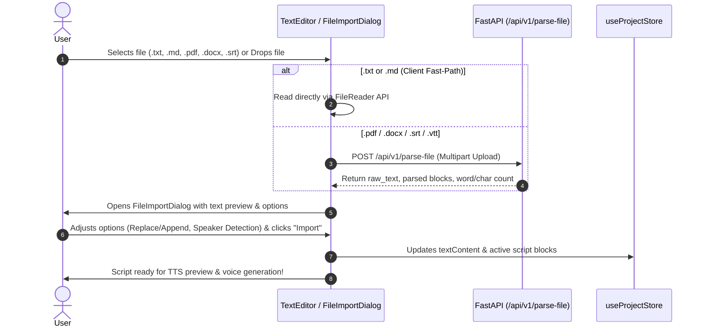

# 📄 KobeanAudio File Upload & Text Parsing Design Specification

- **Feature**: Document File Upload & Text Parsing for Text-to-Audio
- **Date**: 2026-09-02
- **Status**: Approved

---

## 1. Overview & Goals

Enable creators and sound designers to upload documents (.txt, .md, .pdf, .docx, .srt, .vtt) and extract script text directly into KobeanAudio Studio. Users can preview parsed content, configure speaker block auto-detection, choose between replacing or appending text, and immediately synthesize speech across the 7 TTS engines.

---

## 2. Architecture & Components

### 2.1 Backend Parsing Service (`apps/api`)

- **Endpoint**: `POST /api/v1/parse-file`
- **Supported Formats**:
  - Plain Text & Markdown (`.txt`, `.md`)
  - Adobe PDF (`.pdf`) via `pypdf`
  - Microsoft Word (`.docx`) via `python-docx`
  - Subtitle / Closed Caption files (`.srt`, `.vtt`)
- **Parsing Capabilities**:
  - Multi-page PDF text extraction with layout and hyphen wrap normalization.
  - Heading and paragraph extraction for `.docx`.
  - Subtitle line extraction (stripping timestamps, cue indexes, and formatting tags).
  - Speaker cue pattern detection (`Speaker: Text` or `[Speaker] Text`).
  - Text statistics computation (word count, character count, estimated speech duration @ 150 wpm).

#### Pydantic Schemas (`apps/api/domain/models.py` & `packages/types`)
```python
class ParsedBlock(BaseModel):
    speaker: str = "Narrator"
    text: str

class ParseFileResponse(BaseModel):
    filename: str
    file_type: str
    raw_text: str
    blocks: list[ParsedBlock]
    word_count: int
    char_count: int
    estimated_duration_sec: float
```

### 2.2 Frontend UI & State (`apps/web`)

- **File Upload Triggers**:
  - **Import File Button**: Added to `TextEditor.tsx` toolbar with `<Upload />` icon and tooltip.
  - **Drag & Drop Zone**: Visual drag-over highlight on the script editor area.
- **Client Fast Path**:
  - Client-side reading for `.txt` and `.md` files via `FileReader` API for instant response without network latency.
  - Calls `POST /api/v1/parse-file` for binary and structured formats (`.pdf`, `.docx`, `.srt`, `.vtt`).
- **File Import Preview Dialog (`apps/web/src/components/editor/FileImportDialog.tsx`)**:
  - Built with Radix UI Dialog + Framer Motion (`modalMotion` from `@/lib/motion`).
  - Styled with KobeanAudio theme tokens and `.glass-popover`.
  - **Header & Metrics**: Displays filename, file format badge, word count, character count, and estimated TTS read time.
  - **Interactive Preview Editor**: Toggle between Raw Text view and Block Dialogue view with editable text.
  - **Import Options**:
    - **Import Mode**: Replace current script vs. Append to existing script.
    - **Speaker Block Detection**: Automatically convert `[Speaker]` or `Speaker:` patterns and subtitle cues into discrete dialogue blocks.
    - **Clean Whitespace**: Normalize redundant line breaks and spaces.
  - **Actions**: `Cancel` and `Import into Editor`.

---

## 3. Data Flow



---

## 4. Error Handling & Edge Cases

- **Unsupported Format**: Return descriptive HTTP 400 bad request error with list of allowed extensions.
- **Empty / Corrupt Files**: Notify user with toast error and keep existing editor contents untouched.
- **Large Files (> 10MB)**: Validate file size on client before upload; show informative notification if file exceeds limit.
- **Encoding Fallbacks**: Backend attempts UTF-8, then Latin-1, then Windows-1252 for text files.
- **Offline / Desktop Mode**: Client-side fallback works seamlessly in Tauri desktop shell for basic text/markdown files.

---

## 5. Testing Plan

- **API Unit Tests**:
  - `tests/test_parse_file.py`: Test parsing `.txt`, `.md`, `.pdf`, `.docx`, `.srt`, `.vtt`, error handling for invalid files, and speaker cue extraction.
- **Frontend Component Tests**:
  - Verify `FileImportDialog` opens upon file selection, updates preview, toggles options, and properly commits text into `useProjectStore`.
