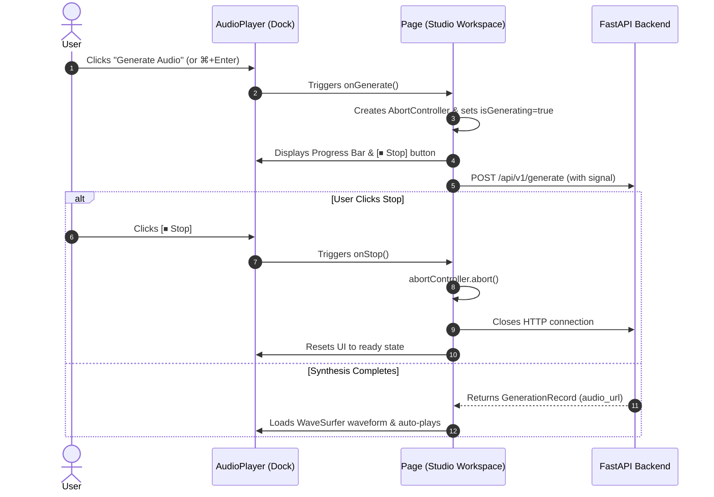

# ⏹️ KobeanAudio Synthesis Progress Bar & Stop Option Design Specification

- **Feature**: Real-Time Progress Bar & Stop/Cancel Synthesis Control
- **Date**: 2026-09-02
- **Status**: Approved

---

## 1. Overview & Goals

Provide visual telemetry and immediate user control during speech synthesis:
1. **Dynamic Progress Bar**: Display real-time percentage and phase messages in the bottom transport dock waveform area while synthesizing audio.
2. **Stop / Cancel Synthesis**: Allow creators to immediately stop / abort active synthesis with an animated `[⏹ Stop]` button in the dock, canceling in-flight HTTP/SSE requests without crashing or throwing unwanted errors.

---

## 2. Architecture & Components

### 2.1 Abort Signal & State Management (`apps/web`)

- **API Client (`apps/web/src/lib/api.ts`)**:
  - Extend `generateAudio(payload: TTSRequest, signal?: AbortSignal)` to pass `signal` into the `fetch()` call.
- **Studio State (`apps/web/src/app/page.tsx`)**:
  - Maintain `abortControllerRef` to store the active `AbortController`.
  - Maintain `streamProgress: { percent: number; message: string } | null`.
  - Provide `handleStopGeneration()`:
    - Calls `abortControllerRef.current?.abort()`.
    - Resets `isGenerating` to `false` and `streamProgress` to `null`.
    - Ignores `AbortError` in catch blocks and avoids displaying generic error alerts.

### 2.2 Bottom Transport Dock UI (`apps/web/src/components/player/AudioPlayer.tsx`)

- **Props**:
  - `isGenerating: boolean`
  - `canGenerate: boolean`
  - `progress: { percent: number; message: string } | null`
  - `onGenerate: () => void`
  - `onStop: () => void`
- **Dynamic Generate / Stop Button**:
  - **Ready State**: Shows `[✨ Generate Audio ⌘↵]` with theme accent styling.
  - **Synthesizing State**: Shows `[⏹ Stop]` with rose/amber glass styling and `<Square className="fill-current w-3.5 h-3.5" />`.
- **Waveform Area Progress Bar**:
  - When `isGenerating` is active, displays an animated glass progress track:
    - Glowing progress bar fill based on `progress.percent` (interpolated smoothly from 10% to 95%).
    - Phase status message (e.g. *"Synthesizing speech... 45%"*).

---

## 3. Data Flow

---

## 4. Testing & Verification

- Verify clicking **Stop** aborts fetch request immediately without throwing error popups.
- Verify progress percentage animates from start to finish during normal synthesis.
- Verify keyboard shortcut `⌘+Enter` works seamlessly with the new generate/stop state.
